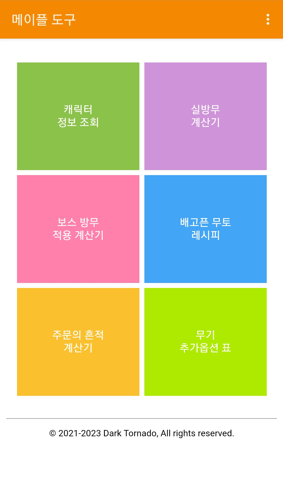

# 매이플 도구
© 2021-2022 Dark Tornado, All rights reserved.

## 요약
* [메이플스토리](https://maplestory.nexon.com/)와 관련된 잡기능 모음 앱

## 라이선스
* [GPL 3.0](LICENSE)

## 기능 목록
* 캐릭터 정보 조회
* [실방무 계산기](https://github.com/DarkTornado/MapleIgnoreDEFCalc)
* 보스 방무 적용 계산기
* [배고픈 무토](https://m.maplestory.nexon.com/Guide/GameInformation/SpecialContents/ArcaneRiverSpecial#3) 레시피 목록 조회

## 개발중 & 수정중인 기능 목록
* [x] [주문의 흔적](https://maplestory.nexon.com/Guide/GameInformation/ItemEnhancement/Upgrade) 강화 계산기
  * [x] 무기
  * [x] 장갑
  * [x] 방어구
  * [x] 장신구
* [x] 무기 추가옵션 목록
  * [x] 파프니르 (150제)
  * [x] 앱솔랩스 (160제)
  * [x] 아케인셰이드 (200제)
  * [x] 제네시스
  * [x] 제로 무기 추가옵션 표
* [x] 메소 시세 조회
* [x] 실방무 계산기 : 소수점 아래 두 자리 까지 계산 가능하도록 변경
  * 2021년 4월 22일에 있었던 [클라이언트 1.2.347](https://maplestory.nexon.com/news/update/626) 변동사항 반영

## 다운로드
* [Google Play 스토어](https://play.google.com/store/apps/details?id=com.darktornado.mapletools)

## 스크린샷

## 업데이트 내역

### 버전 1.1
* 안드로이드 7 이상에서 캐릭터 정보 조회 기능이 정상적으로 작동하지 않는 오류 수정

### 버전 1.0
* 기능 4가지 지원 (캐릭터 정보 조회, 실방무 계산기, 보스 방무 적용 계산기, 배고픈 무토 레시피 목록 조회)

## 필요 라이브러리
* [jsoup](https://jsoup.org/) - MIT License
